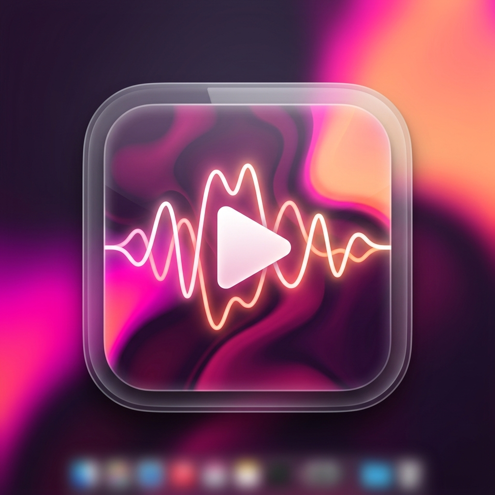

# Muvi 🎵

A sleek, premium, frameless desktop music visualizer and controller for Windows 10/11, built with Flutter and C++/WinRT.

## Features

- **Apple Music-Style Aesthetic:** A beautifully vibrant, fluid, blurred mesh gradient background featuring deep plum, magenta, and peach that resembles frosted glass.
- **Live Hardware Audio Visualizer:** High-performance, 60 FPS buttery-smooth FFT audio spectrum analyzer capturing real-time loopback audio directly from the Windows WASAPI subsystem.
- **Global Media Sync:** Integrates flawlessly with the Windows Global System Media Transport Controls (GSMTC) to extract album art, track details, timeline, and current playback position from supported players (Spotify, Edge, etc.).
- **Frameless Window:** Custom acrylic-backed frameless window using `bitsdojo_window` and `flutter_acrylic`.
- **Interactive Timeline:** A scrubbable timeline synced to the native OS playback ticks.

## Architecture

Muvi combines the beauty of Flutter's rendering engine with the performance of native Windows C++ APIs:
- **UI:** Flutter Desktop (Dart)
- **Audio Capture:** WASAPI Loopback Capture (C++) on a dedicated background thread.
- **Audio Processing:** Custom radix-2 Cooley-Tukey FFT implementation in C++ producing 16 log-spaced perceptual frequency bands.
- **Media Controller:** Windows `GlobalSystemMediaTransportControlsSessionManager` (C++/WinRT) mapped directly into Flutter via Platform Channels.

## Building and Installation

### Quick Install
To easily distribute or install the app locally, an Inno Setup script (`muvi_installer.iss`) is provided. Compile the release build of the Flutter app, open the script in Inno Setup, and build it to generate a standalone installer!

### Build from Source
1. Ensure you have the Flutter SDK and Visual Studio 2022 with C++ Desktop Development installed.
2. Run `flutter pub get`
3. Run `flutter build windows --release`
